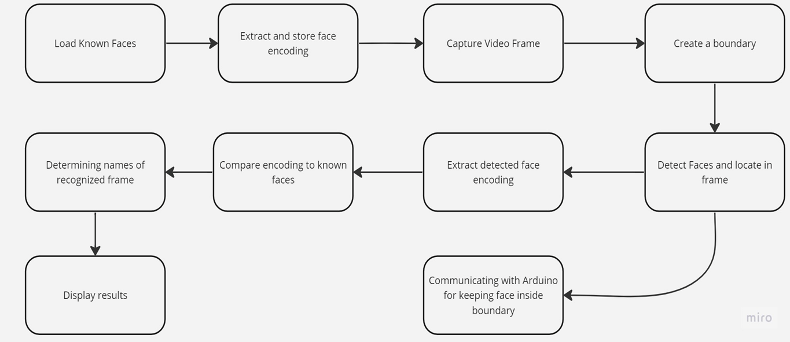

# 📷 Face Tracking System with LED Indication

This is a real-time face recognition and tracking system using Python, OpenCV, and the `face_recognition` library. The project uses a webcam to detect known faces and controls an Arduino-connected LED based on the position of the detected face relative to a boundary box. It also includes optional 3D design files for physical mounting.
This was the part of my Academic Project for the Course IAI. 
This Github Repository is not the final output of the objective. This demonstrates the working of face recognition part and the output is led blinking along the direction of face, which can be tweaked to change the output for servo motor for which the 3d design files are attached.

---

## ✨ Features

- Real-time face detection and recognition
- Face encoding from user-supplied image dataset
- LED ON/OFF control based on face position (via Arduino)
- Modular, easily extendable Python codebase
- 3D printable hardware design included

---

## 🗂️ Project Structure

```

├── 3d\_design/                # STL files for hardware/mounting
├── coding files/            # Main Python scripts
│   ├── main\_video.py        # Real-time face recognition and LED control
│   ├── simple\_facerec.py    # Encodes and detects known faces
│   ├── controller.py        # Communicates with Arduino
│   └── image\_comparison.py  # Face comparison tester
├── images/                  # screenshots 
├── FTS ppt.pptx             # Project presentation
├── README.md                # This file
└── .gitattributes

````

---

## 🛠️ Requirements

- Python 3.8+
- [face_recognition](https://github.com/ageitgey/face_recognition)
- OpenCV
- NumPy
- PyFirmata (for Arduino-USB communication)

Install with:

```bash
pip install face_recognition opencv-python numpy pyfirmata
````

---

## ⚙️ Setup & Usage

1. **Image Dataset**
   Add images of known individuals to the `images/` directory. Filenames will be used as names.

2. **Configure Arduino Port**
   Update `controller.py` with your actual COM port:

   ```python
   comport = 'COM11'  # Modify if needed
   ```

3. **Run the Main Script**

   ```bash
   python "coding files/main_video.py"
   ```

4. **Functionality**

   * If a known face is detected **outside** the bounding box → LED ON
   * If the face is **within** the box → LED OFF

---

## 🧩 3D Design

STL files (`tracker v6.stl`, `tracker v8.stl`, `main.stl`) located in the `3d_design/` folder can be 3D printed for custom mounting solutions 

---

## ✔️ Methodology




---

## Modifications 

- This is not the final objective of the Work Idea 
-  The current work can be modified to meet the final outcome
-  This current model is limited to the led actuated output which can be further modified with some tweaking in the in the controller code. 
-  Further, modification of future proposed work is not commited as of this commit.

## Contribution 
- This Repo is open to contribution 
- Go ahead, to clone or fork the repo 
- Create your own feature and then commit it into your branch 
- Send a Pull request for your feature commit 


